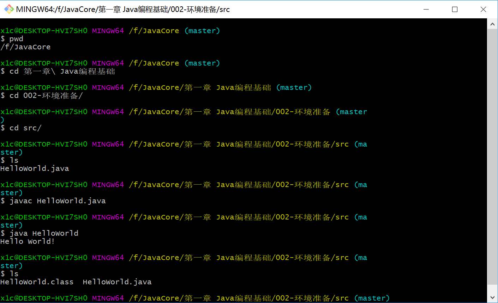

# 第一章 Java编程基础

# 1、概述

## Java能做什么

Java能做什么

* Android App
* 网站后台
* 系统后台
* 大数据
* 桌面工具

主要使用Java语言  听得懂  学得会  用得上   编程大门

学习编程有哪些好处？

既能挣钱 又感兴趣

完成一个程序后 创造带来的成就感

计算机的大门   编程不再神秘   能把脑子里的想法 做成程序展示出来

编程  +  专业知识

为什么选择Java呢？

Java语言难度适中 适用性强

Java是世界上最流行的编程语言

Java是一门主动拥抱变化的语言

困难

抽象   思维方式  行为方式

计算机的思维方式    和计算机进行交流

类比  比喻  例子程序

学会Java语言的基础语法  实际的程序 小工具

为更深层次编程知识地学习打好基础  合格的  

## 编程简介

编程简介

* 编程就是让计算机按自己的意思去工作

* 编程语言就是一种计算机能“理解”的语言。

## 内容

Java编程基础内容

1、Java语言核心语法

2、编程语言基础

3、编程语言和概念难点解析

4、常用库（工具箱）

5、各种大小练兵的**例子 **   小  特点的语法点没有实际的意义   大 有意义

6、面向对象的思想

7、环境和工具使用

8、做出一个小游戏  小程序做个 

# 2、环境搭建

## 下载安装JDK

JDK（Java Development Kit）

搜索JDK并下载

https://www.oracle.com/java/technologies/javase-downloads.html

安装JDK  网上有很多教程的找一个安装下即可

## 检测JDK安装是否成功

运行java命令

```bash
java -version
```


运行javac命令

```bash
java -version
```


我安装的是OpenJDK - 11

```bash
C:\Users\x1c>java -version
openjdk version "11.0.2" 2019-01-15
OpenJDK Runtime Environment 18.9 (build 11.0.2+9)
OpenJDK 64-Bit Server VM 18.9 (build 11.0.2+9, mixed mode)

C:\Users\x1c>javac -version
javac 11.0.2

C:\Users\x1c>

```


## 编写运行第一个程序 - Hello World

编写程序

HelloWorld.java

```java
public class HelloWorld{
    public static void main(String[] args){
        System.out.println("Hello World!");
    }
}

```

运行程序



```bash
javac HelloWorld.java
java HelloWorld
```


## 练习题

尝试用程序输出不同的字符出来，可以尝试不同的长度，中文等。

```java
public class HelloWorld{
    public static void main(String[] args){
        System.out.println("Hello World! Go!GO!GO!");
    }
}

```


# 3、 详解 HelloWorld 程序

## 类（class）语法元素

```java
public class HelloWorld{
    
}
```

* public class是类修饰符
* HelloWorld是类名,要与文件名一致
* 大括号内是类的内容

类别

## Main方法语法元素

```java
public class HelloWorld{
    public static void main(String[] args){
      System.out.println("Hello World! Go!GO!GO!");
    }
}

```

* public static void 是方法修饰符

* main()小括号内是方法的参数（parameter）
* String[] args 是方法参数
* 大括号内是方法的内容，又称方法体（method body）
* Main 方法最为特殊的一点是，它是 Java 程序的入口。就好像游戏的开始按键。

方法  方法体 一步步步骤

## System.out.println

```java
public class HelloWorld{
    public static void main(String[] args){
        System.out.println("Hello World!");
    }
}

```

* System.out.println 是 Java 平台提供的类库的内容。可以将内容输出 到标注输出，在我们的例子里，就是命令行（command line）
* 小括号里的内容还是参数列表。
* 没有参数的情况下，System.out.println 会输出一行空行，也就是类似于 我们敲下一个回车。


## 字符串

```java

public class HelloWorld{
    public static void main(String[] args){
        System.out.println("Hello World!");
    }
}

```

* 在 Java 里，双引号引起来的内容叫做一个字符串。
* 字符串不是语法内容，可以写任意字符。

## 初识Java程序

```java
public class HelloWorld{
    public static void main(String[] args){
      
    }
}
```


初识class

* class是Java 语言中的一等公民，Java 程序就是一个个的类组成的
* class后面的名字是类名
* 类由修饰符，类名和类的内容组成。
* 类名必须与保存类源文件的文件名相同，文件名后缀必须是小写的Java

初识main

* main 方法是 Java 程序执行的入口。
* 方法由方法修饰符，方法名，参数列表和方法体等组成。

# 4、集成开发环境（IDE）的安装和使用

## 下载安装 IntelliJ IDEA 

下载安装IDEA 旗舰版 、社区版

https://www.jetbrains.com/idea/download/

启动和初始设置

## IntelliJ 简单上手

IntelliJ 简介和术语说明

创建第一个项目

IntelliJ 界面和主要功能介绍
自动保存
工具栏编译运行
语法高亮

什么叫 IDE

## 在第一个项目里创建 Hello World 程序

创建一个新的 Class（类）

编译运行—— IntelliJ 帮我们做了什么

编写 编译 运行

# 5、从加减乘除到变量

## 计算加减乘除

计算加减乘除的程序（例程 MathCalc）

```java
public class MathCalc {
    public static void main(String[] args) {
        System.out.println("5+6");
        System.out.println(5+6);
        System.out.println(5-6);
        System.out.println(5*6);
        System.out.println(5/6);
        System.out.println(5/6.0);
        System.out.println(5.0/6.0);

        System.out.println(1+2-3*4/5);
        System.out.println((1+2-3)*4/5);
        System.out.println((1+2+3)*4/5);
    }
}

```


字面值（literal value）
加减乘除运算符

如何方便的计算类似y=a*x+b*x*x+c*x*x*xx这样的公式?

```java
public class Variable {
    public static void main(String[] args) {
        int a = 3;
        int b = 4;
        int c = 5;

        int x = 6;
        int y = a*x + b*x*x + c*x*x*x*x;
        System.out.println(y);
    }
}
```


## 基本数据类型—— int

基本数据类型—— int

Java中所有的数据都有类型，类型决定了存储的形式和占用的存储空间。举个例子：
微博
博客
连载小说

？？？id ?

int用来表示一个整数，取值范围在 -2^31 ~ 2^31-1。 计 算出来是-2147483648 ~ 2147483647

## 关键字（key word）和标示符（Identifier）

关键字（key word）和标示符（Identifier）

标示符：

* 由大小写英文字符，数字和下划线(_)组成的，区分大小写的，不以数字开头的文字。
* 可以用作 Java 中的各种东西的名字，比如类名，方法名等。
* 标示符是区分大小写的。

关键字是 Java 语法的保留字，不能用来做名字。

我们接触到的关键字：

public
class
static
void
int

Java关键字 含义 ：https://blog.csdn.net/qq_41569732/article/details/103209422

## 用变量解决问题

例程 Variable1
变量（variable）
如何创建变量
如何给变量一个值
如何使用变量

# 6、从加减乘除到变量和语句

## Java 代码三级跳——表达式，语句和代码块

Java 代码三级跳——表达式，语句和代码块

表达式（expression）：Java	中最基本的一个运算。比如一个加法 运算表达式。1+2是一个表达式，a+b 也是。

语句（statement）：类似于平时说话时的一句话，由表达式组成，  以；结束。1+2; 1+2+3; a+b; 都是语句。

代码块：一对大括号括起来的就是一个代码块。

## Java 是区分大小写的

关键字和标示符都是区分大小写的
类名必须与文件名一致，包括大小写要求
使用变量时，名字必须和声明变量时的标示符大小写一致
方法名也区分大小写。main 和 Main 是两个名字
类型也区分大小写。int是数据类型，Int 则不是
System.out.println 可以被 Java 认识，SYSTEM.Out.Println 就不可以

## 字面值不简单

整数的字面值类型默认是 int

十六进制字面值和八进制的字面值

超过 int 的范围会怎么样？ 需要使用取值范围更大的类型

## int x = 5;	int y = x + 1;	包含多少语法点？

int x = 5;
关键字
标示符
运算符
字面值
数据类型，Java中的数据都有类型，数据类型有其取值范围
变量的创建和赋值
int y = x + 1;
变量的使用，标示符区分大小写
加法运算符
表达式，语句和代码块

# 7、Java 中的基本数据类型

## 认识二进制

十进制
每一位可以是 0~9 这10个值，到10进位。一百用十进制表示就是100，十就是10。
二进制
每一位可以是0和1这两个值，到2进位。一百用二进制表示就是1100100，十就是1010。
十六进制
每一位可以是0~F这15个值，到16进位。一百用十六进制表示就是64，十就是A。
bit和byte
一个二进制的位叫做一个bit。俗称小b。宽带中的单位，都是小b
八个二进制的位，组成一个 byte，俗称大 B。硬盘等存储的单位，都是大B
Byte 是计算机中基本的衡量存储的单位，计算机在对外使用时不会用小 b 作为划分 存储的单位。

## 数字的基本数据类型

整数类型
byte 占用1个 byte，值域是 -128 ~ 127
short 占用2个 byte，值域是 -32768 ~ 32767
int占用4个 byte，值域是 -2147483648 ~ 2147483647。Java 中整数缺省是int 类型
long 占用8个 byte，值域是 -9223372036854774808 ~ 9223372036854774807
浮点（小数）类型
float – 有精度，值域复杂±340282346638528859811704183484516925440
double – 精度是float 的一倍，占用8个 byte。Java 中整数缺省是 double 类型。
符号位

## 布尔和字符数据类型

布尔和字符数据类型
boolean 占用4个 byte，值域是 true, false。
char 占用2个 byte，值域是所有字符（最多 65535个）

## 使用各种基本数据类型

例程

L 后缀

感受浮点数精度

整数缺省是int类型，浮点数缺省是 double 类型

编译错误的定位和修正

# 8、Java 中的运算符

## 什么是运算符

运算符对一个或者多个值进行运算，并得出一个运算结果。

运算符的运算结果类型有的是固定的，有时候会根据被计算的值变化。比 如两个 int 相加，结果的类型就是 int。两个 byte 相加，返回值的类型就 是byte。

混淆点：除赋值运算符外，运算符本身不会更改变量的值

## 取模运算符

用来计算余数

负数也可以被取模

负数也可以取模

小数也可以取模

## 整数的除法运算

int 除以 int 还是 int，不会变成浮点数

## 比较运算符和布尔运算符

比较运算符
>比较运算符
>
>=
><
><=
>
>!=

布尔运算符

> 布尔运算符
> !
> &
> &&
> |
> ||

## 小括号运算符

小括号运算符内可以包含任何运算符，决定运算符的顺序

## 运算符优先级

运算符优先级

> ()
> !
> *, /, %
>
> +, -
>
> `>`, >=, <, <=
>
> ==
>
> !=
> &, &&, |, ||
>
> ​	=


理解运算符，灵活记忆优先级
为什么等号的优先级最低？
为什么布尔运算符的优先级低于比较运算符？
为什么比较运算符的优先级比算数运算符低？

## 理解运算符优先级

理解运算符，灵活记忆优先级
为什么等号的优先级最低？
为什么布尔运算符的优先级低于比较运算符？
为什么比较运算符的优先级比算数运算符低？

不要死记硬背，用括号让逻辑更清晰

# 9、Java 中的位运算符

字面值的八进制和十六进制

按位运算符
位移运算符
位运算符不会改变原变量的值

位运算符用处